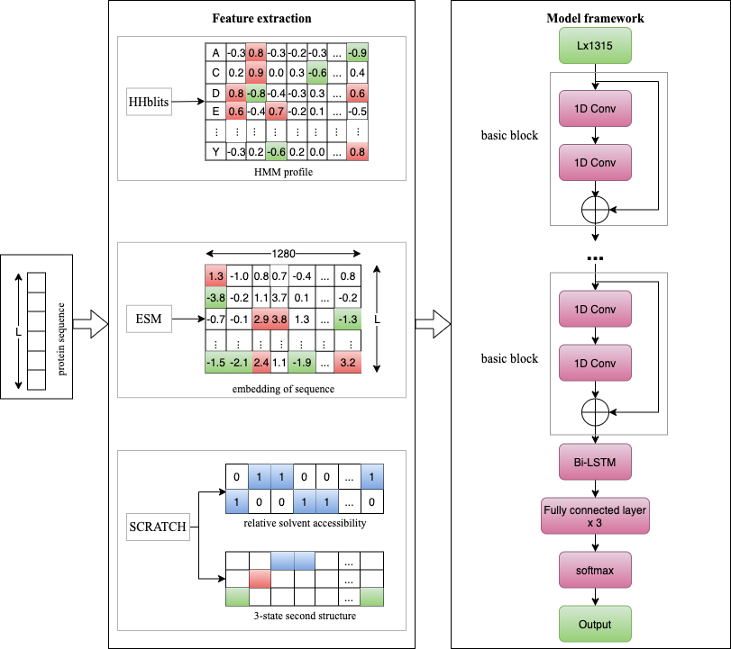

# ResDom
predict protein domain boundary from sequence alone using deep residual network!

1-required tools

    Package                Version             
    ---------------------- --------------------
    esm                    0.1.0               
    Keras                  2.2.0               
    numpy                  1.19.1              
    tensorflow-gpu         1.8.0               
    torch                  1.6.0               

2- run code to predict sample sequence

    cd sample/
    python predict.py

3- the trained models
    
   a) deep model file: sample/res-dom.h5

4- the training scripts

script file for training deep learning model: model_train/model_train.py(the training data path should change to your own) the training data was collected from CATH(V4.1) and the independent testing datasets were derived from the CATH (V4.3)

5- Contact

If you have any questions, comments, or would like to report a bug, please file a Github issue or contact me at 1762276284@qq.com.